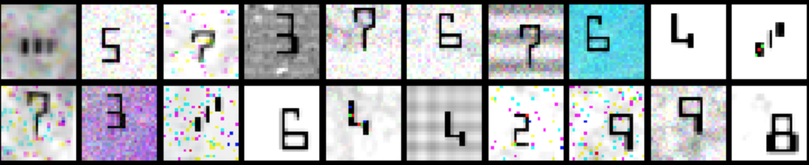
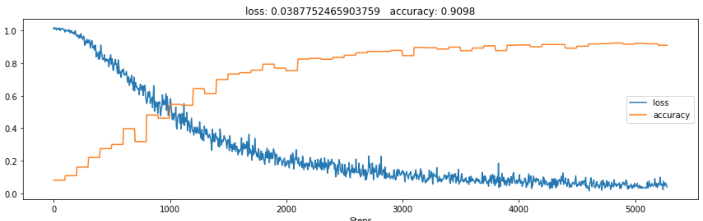

<p align="center"></p>
<h1 align="center">MICRST Competition</h1>

This is the repository accompanying the article:
[From MNIST classification to Intelligent Check Processing](https://blog.filestack.com/api/from-mnist-classification-to-intelligent-check-processing/)

## Quickstart

Use the [introductory notebook](./main.ipynb)

### Step by step:

1. Prepare the dataset config:

    There is a basic example in [..blob/master/dataset/generator.py#L12](..blob/master/dataset/generator.py#L12)  
    You can change images dimensions and probabilities of randomly applied image transformations, e.g. setting:  
    `'blur_probability': 0.5`   
    will generate a dataset where 50% of samples have blurring applied.

    To preview the dataset use the

    ```pytohn
    dataset.generator.make_preview(config)
    ```
    <p align="center"></p>

2. Generate the full dataset:

    Declare total number of sumples and execute the function:

    ```python
    number_of_samples = 60_000
    dataset.generator.make_dataset(
        config=dataset_config,
        number_of_samples=number_of_samples
    )
    ```

    This can take anything from 20 - 90 minutes, depending on the machine you're using and number of samples you choose
    and will create a new directory in the `./tmp` folder of this repository (can change in the config) containing all
    all of the images and one `labels.csv` file with information about the ground truth character for each image.

3. Load dataset with PyTorch loaders:

    Using the same config object you can make training and validation data loaders:

    ```python
    train_loader, test_loader = dataset.dataset.make_dataset_loaders(
        config=dataset_config,
        batch_size=batch_size
    )
    ```

4. Train models!

    We are including a neural network model with 3 convolutional layers, 2 fully connected and batch normalization.
    Is pseudo-python the training procedure boils down to:
    ```python
    model = models.DeepMicrClassifier()
    for batch in train_loader:
        # Load the data
        image_data = batch['image']
        target_labels = batch['label']

        # Feed it to the model
        output = model(image_data)

        # Calculate error
        loss = your_loss_function(output, target_labels)

        # Back propagation
        loss.backward()
        
        # Gradient descent
        optimizer.step()
    ```
    Running the notebook as is should give you 90% accuracy on the validation set.
    <p align="center"></p>

5. Experiment!

    This is clearly a toy example - we encourage you try and beat our baseline. Ideas for improvements:
    - make the model deeper
    - add data augmentation
    - remove convolutional layers
    - remove fully connected layers
    - train multiple models and try the _ensemble_ approach


## Dataset structure


The tree arrangement of the data directory:
```
└── MICRST
    ├── image
    │   ├── MICRST_1000000.png
    │   ├── MICRST_1000001.png
    │   ├── .
    │   ├── ..
    │   ├── ...
    └── labels.csv
```

And the structure of `labels.csv`:
```
label,path
7,./tmp/MICRST/image/MICRST_1000000.png
D,./tmp/MICRST/image/MICRST_1000001.png
.
..
...
```

Where the **label** column is the MICR character in string format.
